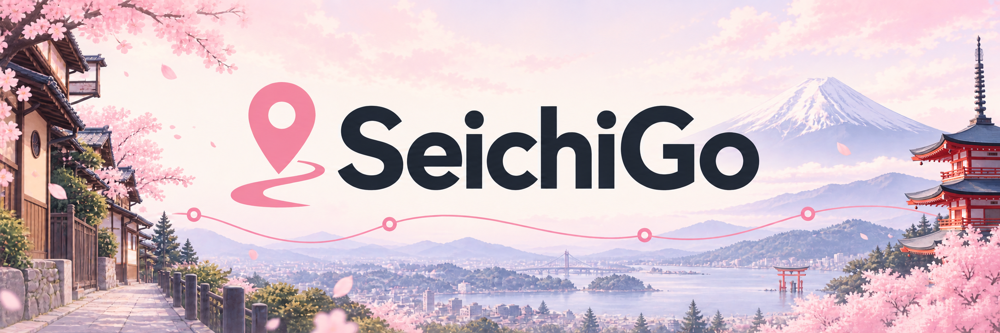
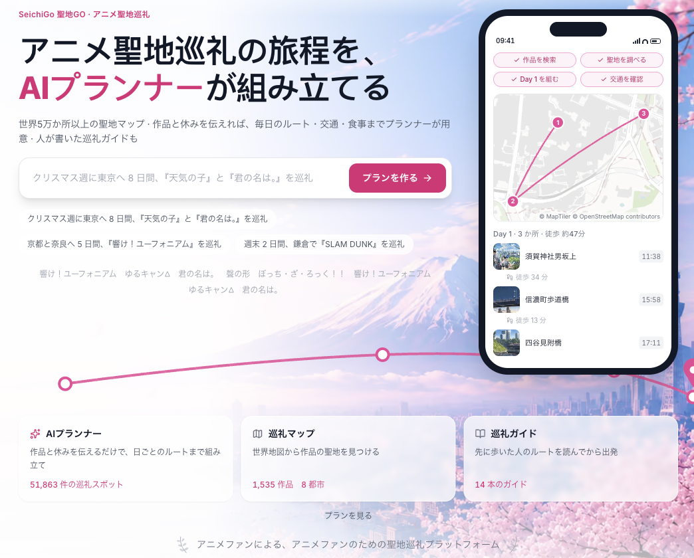
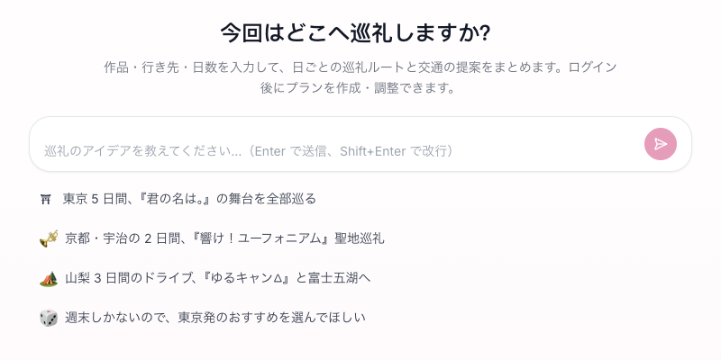
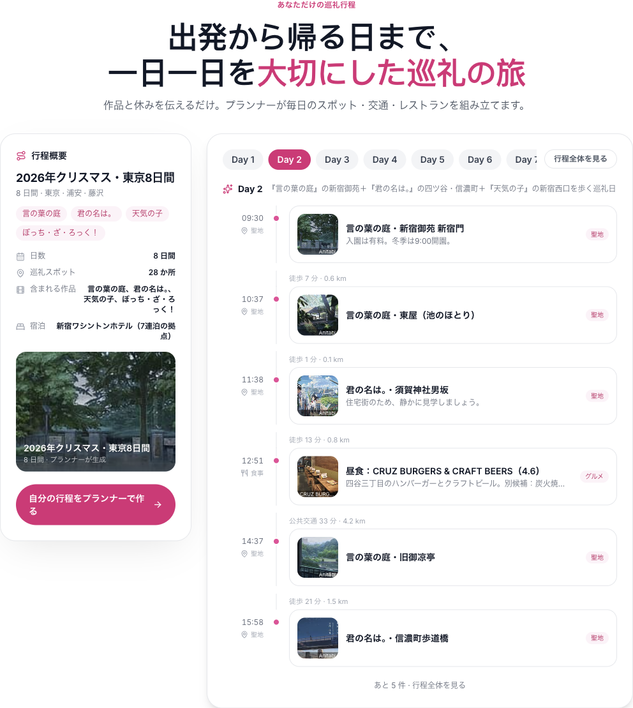
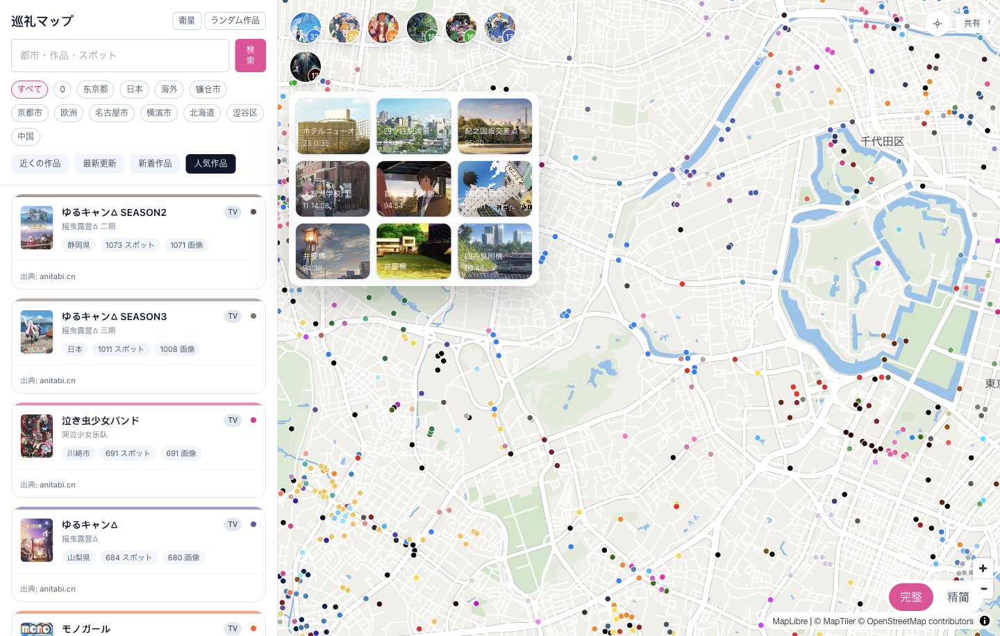
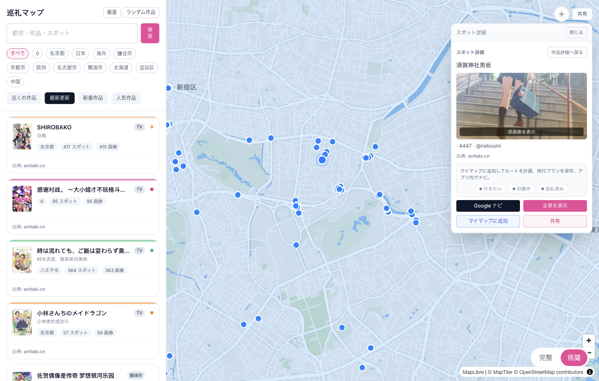
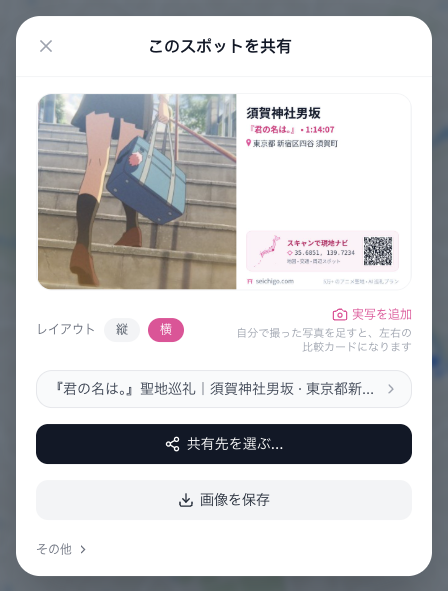

<div align="center">
  <a href="https://seichigo.com/ja">
    
  </a>
  <h1>SeichiGo — アニメ聖地巡礼マップと AI 旅行プランナー</h1>
  <p>好きなアニメの風景を見つけ、旅を計画し、地図を片手に訪れる。自分だけの巡礼記録を残そう。</p>
  <p><a href="README.md">English</a> · <a href="README.zh-CN.md">简体中文</a> · <strong>日本語</strong></p>
  <p>
    <a href="https://seichigo.com/ja">サイトを見る</a> ·
    <a href="https://seichigo.com/ja/plan/start">AI で旅を計画</a> ·
    <a href="https://seichigo.com/ja/map">巡礼マップを開く</a>
  </p>
</div>



## アニメのワンシーンから、実際の旅へ

**SeichiGo** は、**アニメの舞台を探せる聖地巡礼マップ、AI 旅行プランナー、巡礼ガイド**を備えたウェブサイトです。日本語・英語・簡体字中国語に対応しています。聖地巡礼（seichi junrei）とは、好きな作品にゆかりのある実在の場所を訪ね、画面の中の風景に出会う旅です。

好きな作品、訪れる街、旅行に使える日数から始められます。地図でスポットを探し、AI と旅程を相談し、「マイマップ」で行きたい場所を整理。現地ではナビゲーション、場面画像、チェックインを使って巡礼を進められます。

| やりたいこと | 入口 |
| --- | --- |
| 旅行のアイデアを日ごとの旅程にする | [AI 旅行プランナー](https://seichigo.com/ja/plan/start) |
| アニメの舞台や近くのスポットを探す | [聖地巡礼マップ](https://seichigo.com/ja/map) |
| 特定の作品について調べる | [作品一覧](https://seichigo.com/ja/anime) |
| 目的地から巡礼ガイドを探す | [都市別ガイド](https://seichigo.com/ja/city) |
| アカウントの機能や利用上限を確認する | [プランと料金](https://seichigo.com/ja/pricing) |

## AI 旅行プランナーで聖地巡礼を組み立てる

プランナーは、会話と保存できる旅程をつなぎます。行きたい場所や好きな作品を伝え、日ごとの予定と地図を見ながら調整できます。



### 自分の言葉で旅行の希望を伝える

作品名、行き先、日数、日付、出発地点、旅行のペースなどを入力します。必要な情報が足りないときは、AI が追加の質問や選択肢を提示します。日付の選択、画像付きの作品候補、移動手段やペースの質問から希望を絞り込めます。複数回答に対応した質問では、作品をまとめて選べます。

たとえば：

> 東京と鎌倉で、3 日間の聖地巡礼を計画してください。『ぼっち・ざ・ろっく！』と『SLAM DUNK』が好きです。公共交通機関を使い、ゆっくり回りたいです。

これは入力例であり、あらかじめ生成された旅程ではありません。実際の結果は、利用可能なスポット情報、質問への回答、アカウントで使える機能によって変わります。

### 日ごとのカード、タイムライン、地図で確認

- **日別カードとタイムライン**：訪問順、時間帯、各スポットを選んだ理由、移動区間、食事の時間を確認できます。
- **スポットの情報**：利用可能な場面画像や関連作品を表示。旅程にはサイト外の観光地、宿泊施設、食事の時間帯も含められます。
- **日ごとの地図**：その日のスポットと経路を確認し、地図を拡大したり、マーカーから旅程の該当項目へ戻ったりできます。
- **旅程からナビを開く**：単一のスポットや 1 日のルートを Google Maps で開けます。長いルートは必要に応じて区間に分かれます。
- **ストリートビューへのリンク**：対応地域では Google Maps で現地の様子を確認できます。
- **移動情報**：対応プランでは実際の経路を検索できます。推定値を使った区間には、その旨が表示されます。



*ホームページの過去の旅程例を日本語で表示したものです。多言語対応を修正したローカル開発版で、2026 年 9 月 22 日に撮影しました。現在のプラン上限は以下をご確認ください。*

### 相談を続け、再開し、スポットを保存

会話を続けて、ゆとりのある日程にしたり、目的地や予定を変更したりできます。生成中は処理の進行状況を確認でき、実行中のリクエストを停止することもできます。保存した旅程は一覧から再び開き、会話履歴や読み取り専用の旅程スナップショットを確認できます。ページの再読み込みや接続の中断後の再接続にも対応しています。

旅程に含まれる対応済みの**SeichiGo のスポット**は、**「マイマップ」**に保存して整理できます。サイト外の地点、レストラン、宿泊施設の項目はマイマップに取り込まれません。

### 現在の利用条件とプランの違い

AI プランニングにはログインが必要です。現在公開されているプランでは、旅程の日数と取得できる旅行情報が異なります。

| 機能 | 無料 | スタンダード |
| --- | --- | --- |
| 1 旅程の最大日数 | 3 日 | 7 日 |
| 移動の計画 | 参考用の推定値 | 取得可能な場合は実際の経路を検索。必要に応じて推定値を使用 |
| レストランの提案 | 対象外。食事の時間帯は設定可能 | 条件に合う店舗が見つかった場合に提案 |
| 継続利用 | アカウントの利用枠に応じる | アカウントの利用枠に応じる |

最新の料金、利用枠、提供状況は[料金ページ](https://seichigo.com/ja/pricing)をご確認ください。経路検索は、時刻表の正確性や全地域での情報取得を保証するものではありません。出発前にリンク先のナビサービスでも確認してください。

## 聖地巡礼マップ：見つける、調べる、訪れる

[インタラクティブマップ](https://seichigo.com/ja/map)は、アニメ作品と実在の場所を結び付けます。スポット情報や場面の参考画像には [Anitabi](https://anitabi.cn) のデータを利用しています。



### 検索と新しい場所の発見

- **都市名、作品名、スポット名**で検索し、該当する作品や地点に移動できます。
- **最新の更新、最近の作品、人気作品、近くの作品**から探せます。
- 都市で絞り込んだり、**ランダムな作品**から次の巡礼先を見つけたりできます。
- ブラウザーの位置情報を許可すると、**現在地への移動**と周辺の検索を利用できます。
- 作品一覧、作品詳細、スポット詳細を切り替えられます。パネルを閉じて地図を広く表示することもできます。

### 地図の表示方法を選ぶ

- **道路地図**と**衛星画像**を切り替えられます。
- **詳細表示**と**簡易表示**を選び、情報量を調整できます。
- 作品内の**すべてのスポット**と**自分のマーカーのみ**を切り替えられます。
- **行きたい・計画中・チェックイン済み**の状態で自分のマーカーを絞り込めます。
- ズームに応じて、まとまったマーカーや作品の概観から、個々のスポットや画像マーカーへと見ていけます。
- 現在の地図表示を共有したり、作品やスポットの共有リンクから該当する位置を直接開いたりできます。

### 訪れる前にスポットの詳細を確認

詳細パネルには、スポット名、関連作品、座標、利用可能な場面画像がまとまっています。元データに応じて、話数や場面の時刻、補足情報、出典も表示されます。位置情報が利用できる場合は距離も確認できます。画像をプレビューしてアニメの場面と見比べたり、原画像がある場合はダウンロードしたりできます。



詳細パネルでは、次の操作ができます。

- 選んだ目的地への **Google Maps ナビゲーション**を開く。
- 対応する画像がある地点で、**ページ内のパノラマ**を開く。利用可否は地点と提供元によって異なります。
- 保存したスポット、ルートブック、チェックインに基づく**行きたい・計画中・チェックイン済み**の状態を確認する。
- スポットを**マイマップ**に追加して、後から旅行を計画する。
- 直接リンクやスポットの共有カードで、作品や場所を共有する。

### クイック巡礼とチェックイン

**クイック巡礼**は、選んだ作品から開始できます。その作品のスポットを巡る画面で、現在の目的地、ページ内のナビ、進捗を確認できます。スポットをスキップする、チェックインして次へ進む、ナビをやり直すといった操作に対応。Google Maps に移動して案内を使い、戻って巡礼を続けることもできます。

現在地を使う案内には、ブラウザーの位置情報許可が必要です。チェックインにはログインが必要で、写真を任意で追加できます。今回の巡礼の共有カードには訪れたスポットと地点間の推定距離をまとめられます。GPS の移動履歴を記録したものではありません。

### マイマップとルートブック

マイマップでは、スポットの収集から巡礼ルートの整理まで行えます。

- 複数の作品からスポットを集め、自分の候補リストを作る。
- 自分のルートブックを作成・名前変更・削除し、保存したスポットをドラッグしてルートに追加する。
- ドラッグで訪問順を並べ替え、ルートからスポットを外したり、不要な候補を削除したりする。並べ替えエリアは最大 25 スポットに対応しています。
- 地図でルートを確認し、ナビ画面で**公共交通＋徒歩**または**車**を選ぶ。
- ルートに沿ってチェックインし、誤って記録した場合は取り消す。
- 計画したルートを使ってナビゲーションや巡礼記録を進める。

作品から好きな場所を探した後に、実際の位置関係を見ながら旅行を組み立てられます。

### おすすめの場所を共有する

スポットの共有カードは横長・縦長のレイアウトに対応しています。添える文章を編集し、共有メニューから画像や文章をコピー・保存できます。対応する端末では、システムの共有機能も利用できます。ログイン後は自分で撮影した写真を追加し、アニメの場面と実際の風景を並べることもできます。共有先のページでは、作品や目的地を確認して地図やナビへ進めます。



*製品のスクリーンショットは、2026 年 9 月 22 日に日本語画面を実際に操作して撮影しました。ホームページは多言語対応を修正したローカル開発版、プランナーとマップは公開サイトの画面です。旅程は上記の過去のサンプルです。出典・撮影者の表記は原文を保持しています。画面や機能の提供状況は更新される場合があります。*

## 巡礼ガイド、目的地、コミュニティの投稿

作品を詳しく調べるなら[作品一覧](https://seichigo.com/ja/anime)、訪れる街から考えるなら[都市一覧](https://seichigo.com/ja/city)へ。記事では、場面の背景、スポット一覧、ルートの説明をまとめ、地図上の場所をより深く紹介します。

サイトは**日本語・英語・簡体字中国語**に対応しています。掲載記事や翻訳の有無は言語ごとに異なる場合があります。投稿者はサイト上でガイドを執筆し、下書きを保存して、記事や修正内容を審査に提出できます。

## 初めて使うとき

1. [地図](https://seichigo.com/ja/map)で、好きな作品や訪れる都市を検索します。
2. 場面画像を確認し、行きたいスポットを保存します。
3. ログインして [AI プランナー](https://seichigo.com/ja/plan/start)に旅の希望を伝えます。
4. 日ごとの予定を確認・調整し、対応するサイト内スポットをマイマップで整理します。
5. 当日はナビを使って巡り、チェックインし、お気に入りの場所を共有します。

## ローカルで動かす

このリポジトリにはウェブアプリケーションが含まれています。開発には Node.js、npm、PostgreSQL データベースが必要です。

```bash
git clone https://github.com/emptylower/seichigo.git
cd seichigo
npm install
cp .env.example .env.local
# 続行する前に、データベースと認証の設定を入力してください。
cp .env.local .env
npm run db:generate
npm run db:migrate:dev
npm run dev
```

[localhost:3000](http://localhost:3000) を開きます。Prisma CLI は `.env` を読み込み、Next.js は `.env.local` も読み込みます。データベース設定をそろえ、マイグレーションの接続先には開発用データベースを指定してください。

まず `DATABASE_URL`、`DATABASE_URL_UNPOOLED`、`NEXTAUTH_URL`、`NEXTAUTH_SECRET` を設定します。メール、地図プロバイダー、AI サービスをローカルで利用する場合は、それぞれの設定も必要です。詳細は [`.env.example`](.env.example)、[開発参加ガイド](CONTRIBUTING.md#dev-environment)、[デプロイ手順](docs/deployment.md)を参照してください。

### 技術構成

| レイヤー | 技術 |
| --- | --- |
| アプリケーション | Next.js App Router、React、TypeScript |
| UI | Tailwind CSS、Radix UI、TipTap |
| 地図 | MapLibre GL、Supercluster、Google Maps 連携 |
| データ・認証 | PostgreSQL、Prisma、NextAuth |
| コンテンツ | MDX、審査付きリッチテキスト記事 |
| ホスティング・メディア | OpenNext on Cloudflare Workers、R2、Cloudflare Images |
| テスト・監視 | Vitest、Playwright、Sentry |

API ルートは、ドメイン処理をハンドラーとリポジトリに委譲します。コードの配置やモジュールの責務は[アーキテクチャガイド](docs/architecture.md)にまとめています。

### よく使うコマンド

```bash
npm run dev             # 開発サーバー
npm test                # 行数チェックと Vitest
npm run typecheck       # アプリ・テストの TypeScript チェック
npm run test:e2e        # Playwright E2E テスト
npm run cf:build        # Cloudflare Workers 向けビルド
```

### ドキュメント

- [アーキテクチャ](docs/architecture.md)と [API リファレンス](docs/api.md)
- [デプロイ手順](docs/deployment.md)と[運用手順](docs/runbooks/)
- [ロードマップ](docs/roadmap.md)と[変更履歴](CHANGELOG.md)
- [開発参加ガイド](CONTRIBUTING.md)、[行動規範](CODE_OF_CONDUCT.md)、[セキュリティ方針](SECURITY.md)

## データ、貢献、ライセンス

地図のスポット情報やアニメの場面資料には [Anitabi](https://anitabi.cn) のデータを利用しています。地図、パノラマ、ナビゲーション、施設情報には第三者のサービスを利用する場合があります。出典表示や各提供元の利用条件が引き続き適用され、情報や画像の有無は場所によって異なります。

コード、翻訳、巡礼ガイド、スポット情報の修正への協力を歓迎します。[CONTRIBUTING.md](CONTRIBUTING.md) を読み、[投稿用テンプレート](.github/ISSUE_TEMPLATE/content_submission.yml)またはサイトの投稿機能をご利用ください。セキュリティ上の問題は [SECURITY.md](SECURITY.md) の窓口から報告してください。

ソースコードのライセンスは **[PolyForm Noncommercial 1.0.0](LICENSE)** です。商用利用には別途許可が必要です。記事、アニメの画像、写真、第三者のデータには個別の権利やライセンスが適用される場合があります。コードのライセンスは、それらの素材の利用権を付与するものではありません。再利用する際は、出典や記事ごとの表示をご確認ください。

---

[SeichiGo を開く](https://seichigo.com/ja) · [AI で聖地巡礼を計画](https://seichigo.com/ja/plan/start) · [アニメの舞台を探す](https://seichigo.com/ja/map)
