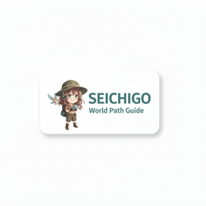
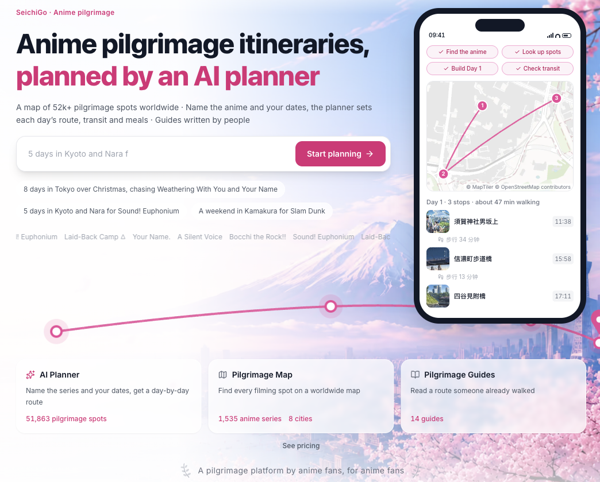
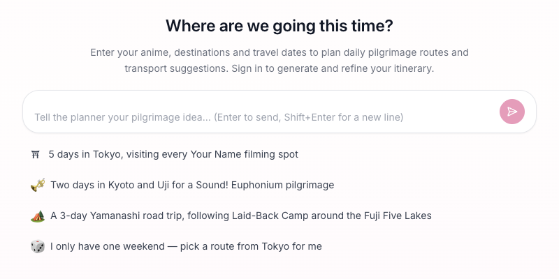
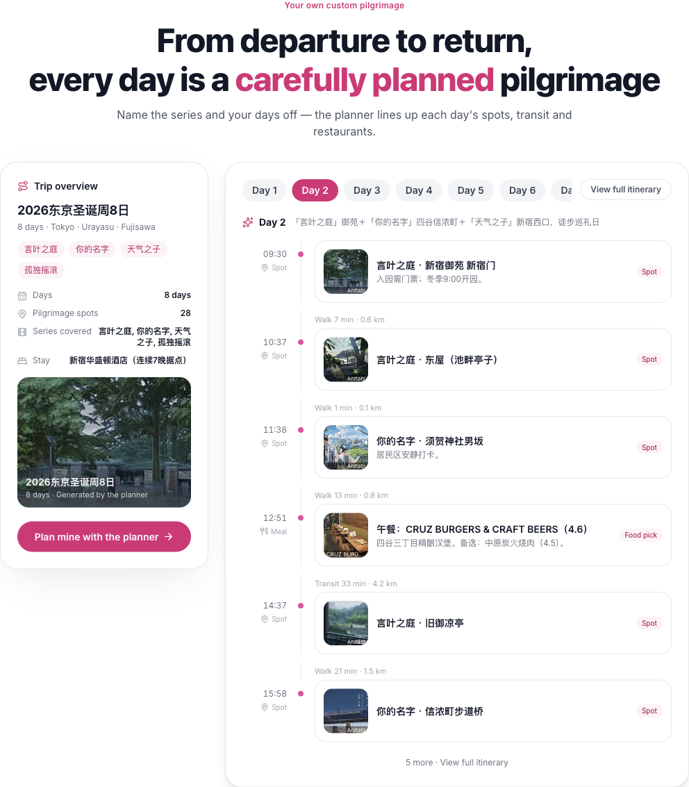
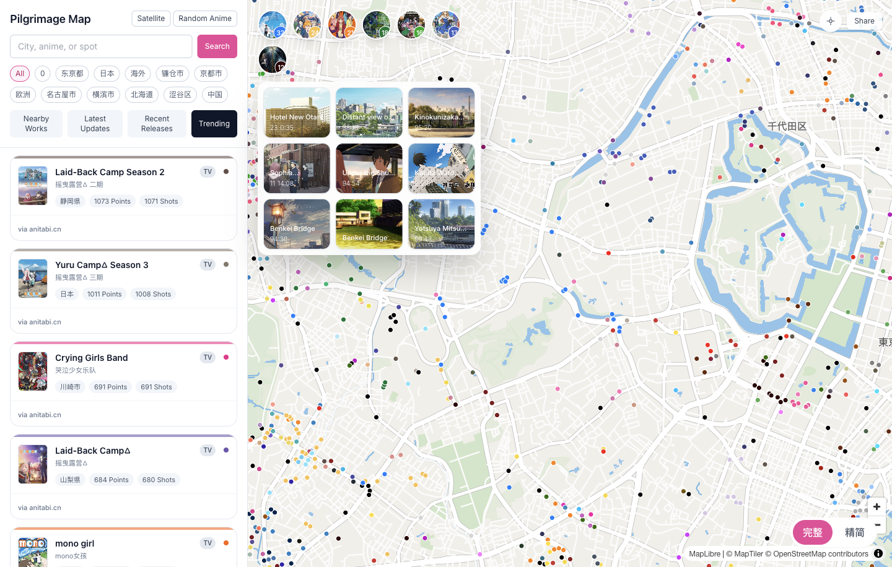
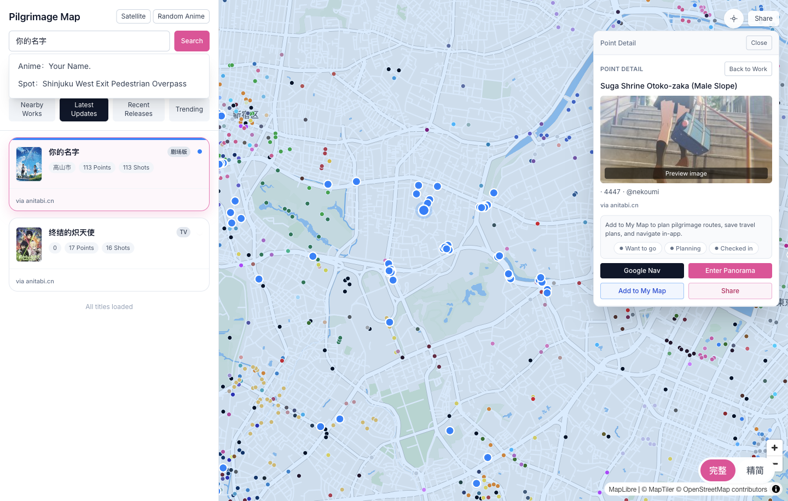
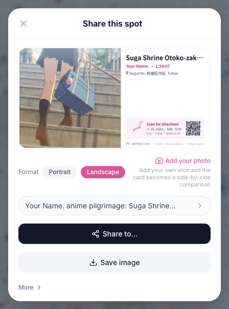

<div align="center">
  <a href="https://seichigo.com/en">
    
  </a>
  <h1>SeichiGo — Anime Pilgrimage Map &amp; AI Itinerary Planner</h1>
  <p>Find the real places behind your favorite anime. Plan the trip, follow the map, and keep a record of your pilgrimage.</p>
  <p><strong>English</strong> · <a href="README.zh-CN.md">简体中文</a> · <a href="README.ja.md">日本語</a></p>
  <p>
    <a href="https://seichigo.com/en">Visit SeichiGo</a> ·
    <a href="https://seichigo.com/en/plan/start">Plan with AI</a> ·
    <a href="https://seichigo.com/en/map">Explore the map</a>
  </p>
</div>



## From an anime scene to a real journey

**SeichiGo** is an anime pilgrimage website with an **anime locations map**, an **AI itinerary planner**, and travel guides in English, Simplified Chinese, and Japanese. Anime pilgrimage, also known as **seichi junrei** (聖地巡礼), means visiting the real-world places connected to a favorite anime.

Start with a series you love, a city you are visiting, or a few days you have available. Discover locations on the map, ask AI to arrange a trip, and organize the places you want to visit in My Maps. On the road, use navigation, scene images, and check-ins to follow your route.

| What you want to do | Where to start |
| --- | --- |
| Turn an idea into a day-by-day trip | [AI itinerary planner](https://seichigo.com/en/plan/start) |
| Find anime locations and explore nearby spots | [Anime pilgrimage map](https://seichigo.com/en/map) |
| Research a particular series | [Anime directory](https://seichigo.com/en/anime) |
| Find pilgrimage guides for a destination | [City guides](https://seichigo.com/en/city) |
| Understand account features and planning limits | [Plans and pricing](https://seichigo.com/en/pricing) |

## AI itinerary planner for anime pilgrimage

The planner connects a conversation to a saved itinerary. Tell it what you would like to see, then review the places, daily schedule, and map together.



### Describe the trip in your own words

Enter the anime, destinations, number of days, dates, starting point, or pace you have in mind. The planner can ask follow-up questions and offer choices when it needs to clarify the trip. Date selection, illustrated anime choices, and questions about pace and transport help narrow it down. You can select multiple works when a question supports multiple answers.

For example:

> Plan a three-day anime pilgrimage around Tokyo and Kamakura. I like *Bocchi the Rock!* and *Slam Dunk*. I will use public transport and would like a relaxed pace.

This is an example request, not a pre-generated itinerary. The result depends on available location data, your answers, and your account's planning features.

### Review a practical, day-by-day itinerary

- **Daily cards and a timeline:** review the order of visits, time slots, reasons for each stop, travel segments, and meal breaks.
- **Location context:** view point images and related anime information where available; external attractions, accommodation, and meal breaks can also appear in the itinerary.
- **A map for each day:** inspect the day's stops and route, expand the map, and open a marker to jump back to its itinerary entry.
- **Navigation from the plan:** open Google Maps for a single stop or the day's route. Long routes are split into navigation segments when needed.
- **Street View links:** preview a location through Google Maps where coverage is available.
- **Transport details:** eligible plans can look up routes and show journey information; estimated segments are marked as estimates.



*Historical itinerary example displayed on the public homepage, captured on September 22, 2026. Current plan limits are listed below.*

### Refine, return, and save useful locations

Continue the conversation to change the pace, swap a destination, or adjust the schedule. Planning progress is visible as the response arrives, and you can stop a running request. Saved plans appear in the plan list so you can reopen a trip, review chat history, and inspect read-only itinerary snapshots. The interface also supports reconnecting after a refresh or interrupted planning session.

Send supported **SeichiGo location points** from an itinerary to **My Maps** to continue organizing your pilgrimage. External places, restaurants, and accommodation entries are not imported into My Maps.

### Current access and plan limits

AI planning requires sign-in. The current public plans differ in both itinerary length and the travel information they can retrieve:

| Capability | Free | Standard |
| --- | --- | --- |
| Maximum itinerary length | 3 days | 7 days |
| Transport planning | Reference estimates | Real route lookup when available; estimates may be used as a fallback |
| Restaurant recommendations | Not included; meal breaks can still be scheduled | Included where matching places are available |
| Continued use | Subject to account usage allowance | Subject to account usage allowance |

See the [live pricing page](https://seichigo.com/en/pricing) for current pricing, allowances, and availability. Route lookup is not a guarantee of timetable accuracy or coverage; check the linked navigation service before departure.

## Anime locations map: discover, inspect, and visit

The [interactive map](https://seichigo.com/en/map) connects anime titles to real-world locations, with point data and scene references sourced from [Anitabi](https://anitabi.cn).



### Search and discover

- Search by **city, anime title, or location name**, then jump to the matching work or point.
- Browse **Latest Updates**, **Recent Releases**, **Trending**, and **Nearby Works**.
- Filter by city or try **Random Anime** to discover a different series.
- Use **Locate Me** and nearby discovery after granting browser location permission.
- Move between the work list, a work's details, and its individual locations; collapse the panel for more map space.

### Choose how you explore

- Switch between **Street** and **Satellite** basemaps.
- Switch between **Complete** and **Simple** display modes for a richer overview or a lighter map.
- Within a work, switch between **All Spots** and **My Markers** to focus on your own locations.
- Zoom from clustered markers and work overviews into individual locations and image markers.
- Filter personal markers by **Want to go**, **Planning**, or **Checked in**.
- Share the current map view, or open a work or point link to return directly to its map context.

### Inspect each location before visiting

A point's detail panel brings together its name, associated work, coordinates, and available scene imagery. Depending on the source data, it also shows an episode or scene timestamp, notes, source attribution, and distance when your location is available. Open an image preview to compare the scene, and download the original image when one is available.



From the point panel, you can:

- Open **Google Maps navigation** for the selected destination.
- Enter an in-page **panorama** when that point has supported imagery; availability depends on the location and provider.
- See personal progress as **Want to go**, **Planning**, or **Checked in**, based on your saved point pool, route books, and check-ins.
- Add a point to **My Maps** for a later trip.
- Share the work or location with a direct link or a location card.

### Quick Pilgrimage and check-ins

**Quick Pilgrimage** starts from a selected anime work and turns its locations into an on-the-go view. Follow the current stop, use in-page navigation, and track your progress. Skip a stop, check in and move to the next one, or restart navigation when needed. You can also hand off to Google Maps and return to continue the pilgrimage.

Location-dependent guidance needs browser location permission, and check-ins require sign-in. You can optionally add a photo when checking in. A session sharing card summarizes visited points and estimated distances between them; it is not a recorded GPS track.

### My Maps and route books

My Maps brings your saved locations and route books together:

- Collect points from different anime in a personal point pool.
- Create, rename, or delete your own route books, and drag saved points into a route.
- Drag stops into your preferred visiting order, move points out of a route, or delete unwanted candidates. The ordering area supports up to 25 points.
- Review the route on a map and choose **public transport + walking** or **driving** in the navigation interface.
- Check in along a route and undo a check-in if you made a mistake.
- Use a planned route as the basis for navigation and pilgrimage progress.

This makes it possible to research by anime first, then organize the trip around the actual places you will visit.

### Share a place, not just a screenshot

Create a point sharing card in landscape or portrait format, edit its accompanying text, and copy or save the card and text using the available sharing actions, including system sharing where supported. After signing in, add your own photo for a scene-versus-reality comparison. Shared location pages help another traveler identify the anime and destination, then continue to the map or navigation.



*All README images are actual browser captures of SeichiGo's English interface, taken on September 22, 2026. The itinerary image is the public homepage example described above. Screens and availability may change.*

## Guides, destinations, and community contributions

Use the [anime directory](https://seichigo.com/en/anime) to research a work or the [city directory](https://seichigo.com/en/city) to plan around a destination. Articles bring scene context, point lists, and route descriptions together so the map has a story behind it.

The website supports **English, Simplified Chinese, and Japanese**. Available articles and translated content may differ by language. Contributors can write through the site's authoring flow, save drafts, and submit guides or revisions for review.

## A simple way to start

1. Open the [map](https://seichigo.com/en/map) and search for a favorite anime or destination.
2. Inspect the scene images and save the locations you want to visit.
3. Sign in and ask the [AI planner](https://seichigo.com/en/plan/start) for an itinerary that fits your trip.
4. Review the daily stops, refine the plan, and organize supported locations in My Maps.
5. Use navigation on the day, check in, and share a place you enjoyed.

## Run SeichiGo locally

This repository contains the web application. For development, use Node.js, npm, and a PostgreSQL database.

```bash
git clone https://github.com/emptylower/seichigo.git
cd seichigo
npm install
cp .env.example .env.local
# Fill in the database and authentication settings before continuing.
cp .env.local .env
npm run db:generate
npm run db:migrate:dev
npm run dev
```

Open [localhost:3000](http://localhost:3000). The Prisma CLI reads `.env`; Next.js also loads `.env.local`. Keep their database settings consistent and point migrations at your development database.

Configure `DATABASE_URL`, `DATABASE_URL_UNPOOLED`, `NEXTAUTH_URL`, and `NEXTAUTH_SECRET` first. Email, map providers, and AI services require their respective configuration to exercise those features locally. See [`.env.example`](.env.example), the [contribution guide](CONTRIBUTING.md#dev-environment), and [deployment documentation](docs/deployment.md) for setup details.

### Technology

| Layer | Technologies |
| --- | --- |
| Application | Next.js App Router, React, TypeScript |
| Interface | Tailwind CSS, Radix UI, TipTap |
| Maps | MapLibre GL, Supercluster, Google Maps integrations |
| Data and authentication | PostgreSQL, Prisma, NextAuth |
| Content | MDX and reviewed rich-text articles |
| Hosting and media | OpenNext on Cloudflare Workers, R2, Cloudflare Images |
| Quality and monitoring | Vitest, Playwright, Sentry |

API routes delegate domain behavior to handlers and repositories. See the [architecture guide](docs/architecture.md) for the code layout and module boundaries.

### Useful commands

```bash
npm run dev             # Development server
npm test                # Line-budget check and Vitest suites
npm run typecheck       # Application and test TypeScript checks
npm run test:e2e        # Playwright end-to-end tests
npm run cf:build        # Build for Cloudflare Workers
```

### Documentation

- [Architecture](docs/architecture.md) and [API reference](docs/api.md)
- [Deployment](docs/deployment.md) and [operations runbooks](docs/runbooks/)
- [Roadmap](docs/roadmap.md) and [changelog](CHANGELOG.md)
- [Contributing](CONTRIBUTING.md), [code of conduct](CODE_OF_CONDUCT.md), and [security policy](SECURITY.md)

## Data, contributions, and licensing

Map locations and anime scene references draw on [Anitabi](https://anitabi.cn). Maps, panoramas, navigation, and place information may use third-party providers. Source attributions and the respective providers' terms continue to apply; data and imagery availability vary by location.

Contributions to code, translations, guides, and location corrections are welcome. Read [CONTRIBUTING.md](CONTRIBUTING.md), use the [content submission template](.github/ISSUE_TEMPLATE/content_submission.yml), or submit a guide through the website. Report security issues through [SECURITY.md](SECURITY.md).

The source code is licensed under **[PolyForm Noncommercial 1.0.0](LICENSE)**. Commercial use requires separate permission. Articles, anime screenshots, photographs, and third-party data may have separate rights or licenses; the repository's code license does not grant rights to those materials. Check source and per-article notices before reuse.

---

[Explore SeichiGo](https://seichigo.com/en) · [Plan an anime pilgrimage](https://seichigo.com/en/plan/start) · [Browse anime locations](https://seichigo.com/en/map)
