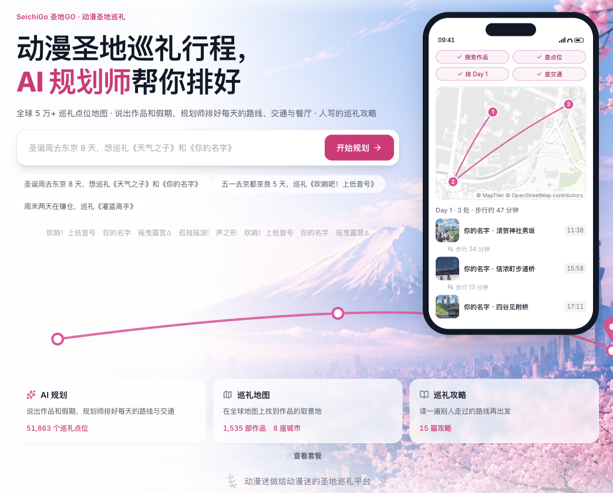
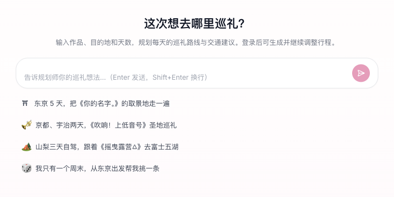
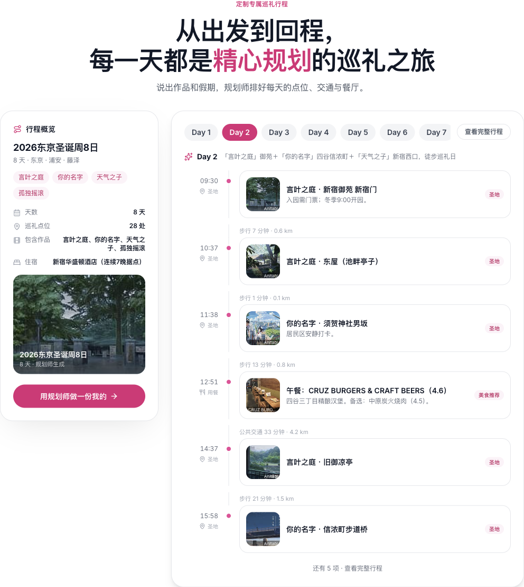
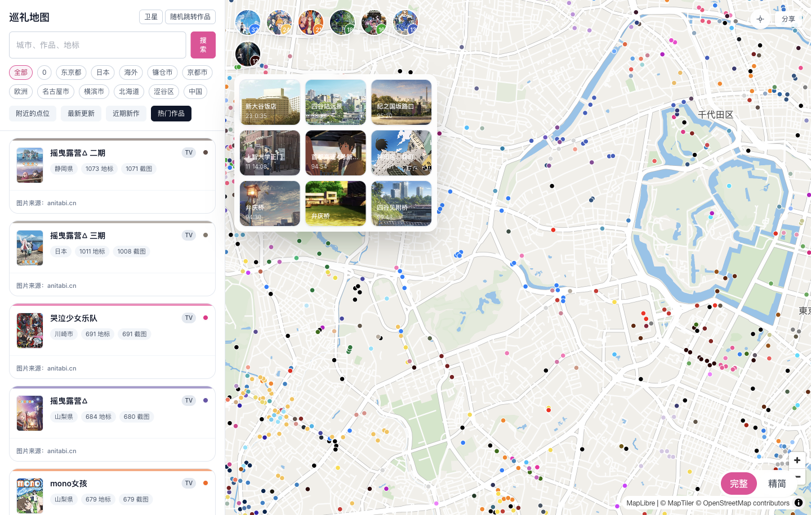
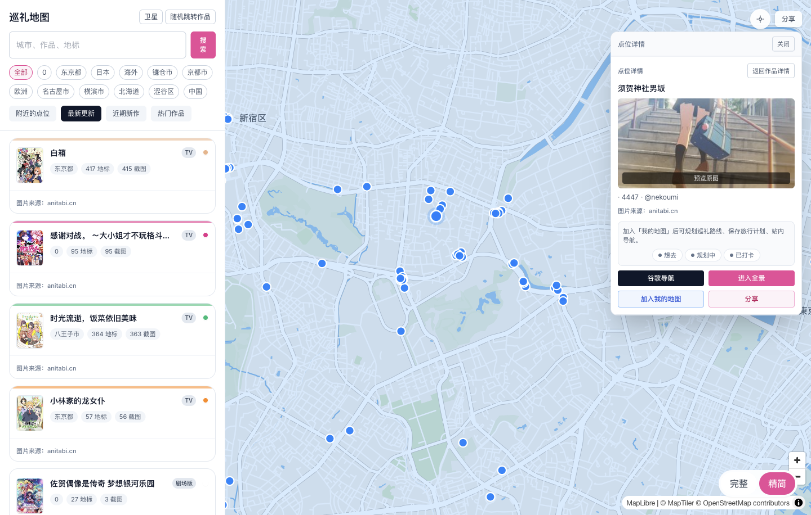

<div align="center">
  <a href="https://seichigo.com">
    
  </a>
  <h1>SeichiGo 圣地 GO — 动漫圣地巡礼地图与 AI 行程规划</h1>
  <p>找到喜欢的动画中的真实地点，规划行程，跟着地图出发，留下自己的巡礼记录。</p>
  <p><a href="README.md">English</a> · <strong>简体中文</strong> · <a href="README.ja.md">日本語</a></p>
  <p>
    <a href="https://seichigo.com">访问网站</a> ·
    <a href="https://seichigo.com/plan/start">AI 规划行程</a> ·
    <a href="https://seichigo.com/map">探索巡礼地图</a>
  </p>
</div>



## 从动画里的一个场景，到现实中的一段旅程

**SeichiGo（圣地 GO）** 是面向动漫爱好者的**圣地巡礼网站**，将**动漫取景地地图、AI 行程规划和图文攻略**放在一起，支持简体中文、英文和日文。圣地巡礼（聖地巡礼，seichi junrei）是前往喜爱作品关联的现实地点，重新发现动画中的街道、车站、海岸与日常风景。

你可以从一部作品、一座城市，或者几天假期开始：在地图上找到点位，让 AI 帮你安排路线，再通过「我的地图」整理想去的地方。出发后，用导航、场景图片和打卡记录完成属于自己的巡礼。

| 你想做什么 | 从这里开始 |
| --- | --- |
| 把旅行想法变成逐日行程 | [AI 行程规划](https://seichigo.com/plan/start) |
| 查找动漫取景地和附近点位 | [圣地巡礼地图](https://seichigo.com/map) |
| 了解某部作品的巡礼地点 | [作品目录](https://seichigo.com/anime) |
| 按目的地查找巡礼攻略 | [城市攻略](https://seichigo.com/city) |
| 了解账户权益与规划额度 | [套餐与价格](https://seichigo.com/pricing) |

## AI 行程规划：边聊边完成巡礼计划

规划器把对话和可保存的行程连接起来。说出想去哪里、喜欢什么作品，再结合每日安排和地图一起调整。



### 用自己的话描述旅行

输入想巡礼的作品、城市、天数、日期、出发地点或旅行节奏。信息不足时，AI 会追问并给出选项；日期选择、带封面的作品选项和节奏、交通偏好问题帮助逐步确定需求；支持多选的问题可以一次选择多部作品。

例如：

> 帮我安排东京和镰仓的三天圣地巡礼。我喜欢《孤独摇滚！》和《灌篮高手》，乘坐公共交通，希望每天不要太赶。

这是一条示例需求，不是预先生成的行程。实际结果取决于可用点位数据、你的回答和账户支持的规划能力。

### 查看逐日卡片、时间线和地图

- **每日行程卡片与时间线**：按顺序查看游览点位、时间安排、推荐理由、交通段和用餐时段。
- **点位信息**：查看可用的场景图片和关联作品；行程也可以包含站外景点、住宿和用餐时段。
- **每日地图**：查看当天点位和路线，展开地图，点击标记后跳回对应行程条目。
- **从行程发起导航**：打开单个点位或整日路线的 Google Maps 导航；较长路线按需要拆分成多段。
- **实景入口**：通过 Google Maps 街景了解现场环境，具体以当地覆盖情况为准。
- **交通信息**：具备相应权益的套餐可查询实际路线；估算交通段会标注为参考估算。



*首页历史行程示例，使用中文正文，截图来自 2026 年 9 月 22 日修复多语言后的本地开发版本。当前可规划的天数与功能以以下套餐说明为准。*

### 继续调整、恢复会话与保存点位

继续对话即可要求放慢节奏、更换目的地或修改安排。生成过程中可以看到规划进度，也可以停止当前请求。已保存的行程会出现在列表中，方便之后重新打开、查看历史对话和只读行程快照；界面也支持在刷新或规划连接中断后重新连接会话。

行程中支持的**站内圣地点位**可以保存到**「我的地图」**，进一步整理自己的巡礼路线。站外地点、餐厅和住宿条目不会一同导入「我的地图」。

### 当前使用条件与套餐区别

AI 规划需要登录。当前公开套餐在行程天数和可获取的旅行信息上有所区别：

| 能力 | 免费 | 标准 |
| --- | --- | --- |
| 单个行程最长天数 | 3 天 | 7 天 |
| 交通规划 | 参考估算 | 可用时查询真实路线；必要时仍会回退为估算 |
| 餐厅推荐 | 不包含；仍可安排用餐时段 | 有匹配地点时提供推荐 |
| 持续使用 | 受账户可用额度限制 | 受账户可用额度限制 |

具体价格、额度和开放情况以[在线价格页](https://seichigo.com/pricing)为准。路线查询不保证时刻表始终准确或所有地区都有覆盖，出发前请结合导航服务确认。

## 圣地巡礼地图：从发现点位到实地出发

[交互地图](https://seichigo.com/map)把作品和真实地点连接起来，点位及场景参考数据来源包括 [Anitabi](https://anitabi.cn)。



### 搜索与发现

- 按**城市、作品或地标名称**搜索，跳转到匹配作品或点位。
- 浏览**最新更新、近期新作、热门作品和附近作品**。
- 按城市筛选，或使用**随机跳转作品**寻找新的巡礼灵感。
- 授予浏览器定位权限后，使用**定位到我的位置**和附近发现功能。
- 在作品列表、作品详情和点位详情之间切换；需要更多地图空间时可以收起侧边面板。

### 选择地图查看方式

- 切换**街道**与**卫星**底图。
- 切换**完整**与**精简**显示模式，选择更丰富的概览或更简洁的地图。
- 在单部作品内切换**全部圣地**与**只看我的标记**，按需聚焦自己的地点。
- 缩放地图，从聚合标记与作品概览逐步查看具体点位和图片标记。
- 按**想去、规划中、已打卡**筛选个人标记。
- 分享当前地图视图，或打开作品、点位分享链接，直接回到对应地图位置。

### 出发前看清每个地点

点位详情汇总名称、关联作品、坐标和可用的场景图片。根据原始数据，还可查看集数或场景时间、备注、来源署名；获得定位后可显示距离。打开图片预览可以对照动画画面；有原图时可以下载保存。



在点位面板中，你可以：

- 打开所选目的地的 **Google Maps 导航**。
- 在点位支持相应影像时进入**站内全景**；是否可用取决于地点与服务提供方。
- 查看由个人点位池、路线本和打卡记录汇总的**想去、规划中、已打卡**状态。
- 把点位加入**我的地图**，留待后续安排行程。
- 通过直达链接或地点分享卡分享作品与点位。

### 快速巡礼与打卡

**快速巡礼**从选定作品启动，将作品点位转为适合出行时使用的界面。查看当前点位，使用站内导航和进度显示；可以跳过点位、打卡后进入下一站，或重新导航。需要时可转到 Google Maps，返回后继续巡礼。

依赖当前位置的引导需要浏览器定位权限，打卡需要登录，并可选择添加实拍照片。本次行程分享卡可以汇总已到访点位和点位间的估算距离，不是记录 GPS 轨迹。

### 我的地图与路线本

「我的地图」将点位收集和路线安排放在一起：

- 从不同作品收集点位，建立个人点位池。
- 创建、重命名或删除自己的路线本，将已保存点位拖拽加入路线。
- 拖拽调整点位顺序，从路线移出点位，或删除不再需要的候选点；排序区最多支持 25 个点位。
- 在地图中检查路线，在导航界面选择**公交＋步行**或**驾车**。
- 沿路线打卡；误操作时可以撤销打卡。
- 以规划好的路线继续导航和记录巡礼进度。

你可以先按作品寻找感兴趣的地点，再按实际地理位置组织出行。

### 分享一个值得去的地方

生成横版或竖版点位分享卡，编辑配套文案，并通过可用的分享操作复制或保存图片与文案；设备支持时也可调用系统分享。登录后可添加自己的实拍照片，制作动画场景与现实的对照卡。地点分享页帮助其他人了解对应作品与目的地，并继续打开地图或导航。


*产品截图均为 2026 年 9 月 22 日实际操作浏览器拍摄的中文界面。首页截图来自修复多语言后的本地开发版本，规划入口和地图截图来自线上网站；行程图为上文注明的历史示例。来源署名保留原文。界面和功能开放情况可能随产品更新而变化。*

## 图文攻略、目的地与社区投稿

通过[作品目录](https://seichigo.com/anime)研究一部动画，或通过[城市目录](https://seichigo.com/city)围绕目的地安排行程。图文文章将场景背景、点位清单和路线说明串联起来，让地图上的位置有更多故事。

网站支持**简体中文、英文、日文**，各语言可用的文章和翻译内容可能不同。贡献者可以通过站内创作流程撰写攻略、保存草稿，并提交文章或修订内容审核。

## 第一次使用

1. 打开[地图](https://seichigo.com/map)，搜索喜欢的作品或准备去的城市。
2. 查看场景图片，保存想去的地点。
3. 登录后，在 [AI 规划](https://seichigo.com/plan/start)中描述适合自己的旅行。
4. 检查逐日点位并继续调整，将支持的站内地点整理进「我的地图」。
5. 出发当天使用导航、完成打卡，分享喜欢的地点。

## 本地运行

本仓库包含网站应用。开发环境需要 Node.js、npm 和 PostgreSQL 数据库。

```bash
git clone https://github.com/emptylower/seichigo.git
cd seichigo
npm install
cp .env.example .env.local
# 先填写数据库和认证配置，再继续执行。
cp .env.local .env
npm run db:generate
npm run db:migrate:dev
npm run dev
```

打开 [localhost:3000](http://localhost:3000)。Prisma CLI 读取 `.env`，Next.js 也会加载 `.env.local`；请保持数据库配置一致，并让迁移指向开发数据库。

优先配置 `DATABASE_URL`、`DATABASE_URL_UNPOOLED`、`NEXTAUTH_URL` 和 `NEXTAUTH_SECRET`。本地使用邮件、地图提供方和 AI 服务时，还需填写对应配置。详细说明见 [`.env.example`](.env.example)、[贡献指南](CONTRIBUTING.md#dev-environment)和[部署文档](docs/deployment.md)。

### 技术栈

| 层次 | 技术 |
| --- | --- |
| 应用 | Next.js App Router、React、TypeScript |
| 界面 | Tailwind CSS、Radix UI、TipTap |
| 地图 | MapLibre GL、Supercluster、Google Maps 集成 |
| 数据与认证 | PostgreSQL、Prisma、NextAuth |
| 内容 | MDX 与经审核的富文本文章 |
| 部署与媒体 | OpenNext on Cloudflare Workers、R2、Cloudflare Images |
| 测试与监控 | Vitest、Playwright、Sentry |

API 路由将领域逻辑交给 handler 与 repository。代码布局和模块边界见[架构文档](docs/architecture.md)。

### 常用命令

```bash
npm run dev             # 开发服务器
npm test                # 文件行数检查与 Vitest 测试
npm run typecheck       # 应用与测试的 TypeScript 检查
npm run test:e2e        # Playwright 端到端测试
npm run cf:build        # Cloudflare Workers 构建
```

### 文档导航

- [架构总览](docs/architecture.md)与 [API 索引](docs/api.md)
- [部署手册](docs/deployment.md)与[运维手册](docs/runbooks/)
- [路线图](docs/roadmap.md)与[更新日志](CHANGELOG.md)
- [贡献指南](CONTRIBUTING.md)、[行为准则](CODE_OF_CONDUCT.md)与[安全策略](SECURITY.md)

## 数据来源、贡献与许可

地图点位与动画场景参考数据来源包括 [Anitabi](https://anitabi.cn)。地图底图、全景、导航和地点信息可能使用第三方服务；来源署名和各服务提供方的条款仍然适用，数据与影像覆盖因地点而异。

欢迎贡献代码、翻译、攻略和点位纠错。请先阅读 [CONTRIBUTING.md](CONTRIBUTING.md)，使用[内容投稿模板](.github/ISSUE_TEMPLATE/content_submission.yml)，或通过网站提交攻略。安全问题请按 [SECURITY.md](SECURITY.md) 提供的渠道报告。

源代码采用 **[PolyForm Noncommercial 1.0.0](LICENSE)** 许可，商业使用需要另行授权。文章、动画截图、照片和第三方数据可能适用单独的权利或许可；仓库的代码许可不授予这些材料的使用权。转载或复用前，请核对来源和逐篇许可说明。

---

[访问 SeichiGo](https://seichigo.com) · [AI 规划圣地巡礼](https://seichigo.com/plan/start) · [探索动漫取景地](https://seichigo.com/map)
